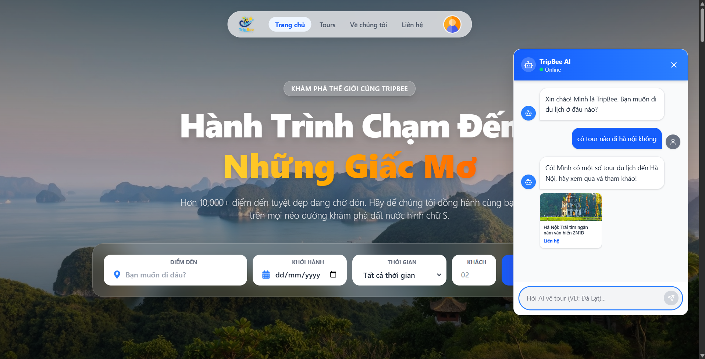
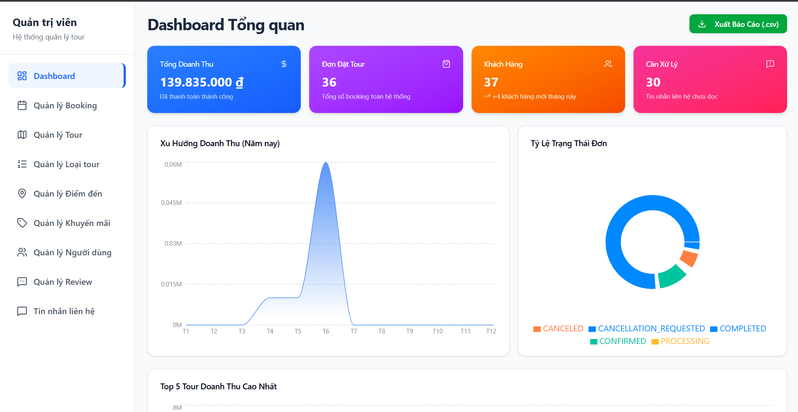

# 🐝 TripBee - Nền tảng Đặt lịch và Quản lý Du lịch Trực tuyến

> TripBee là một ứng dụng du lịch trực tuyến Full-stack giúp kết nối du khách với các dịch vụ du lịch (tour, khách sạn, phòng nghỉ). Dự án được thiết kế hướng tới trải nghiệm người dùng mượt mà và khả năng mở rộng hệ thống tốt, rất thích hợp để giới thiệu năng lực lập trình và tư duy hệ thống.

🌐 **Demo trực tuyến:** [https://tripbeefrontend.vercel.app/]
🔑 **Tài khoản trải nghiệm nhanh (Dành cho nhà tuyển dụng):**

- **Quyền Người dùng (User):** `quocquytnqq@gmail.com` / `111111`
- **Quyền Đối tác / Admin (Partner/Admin):** `quyleom10@gmail.com` / `111111`

---

## 📷 Ảnh chụp giao diện (Screenshots)

_(Chèn 2-3 hình ảnh/GIF đẹp nhất của dự án vào đây để tạo ấn tượng thị giác đầu tiên)_



---

## 🛠️ Công nghệ Sử dụng & Kiến trúc (Tech Stack)

Dự án được xây dựng theo mô hình Client-Server tách biệt hoàn toàn (Decoupled Architecture) nhằm tăng tính linh hoạt và dễ nâng cấp:

### 1. Frontend (React 19 + TypeScript + Vite)

- **Core:** React 19, TypeScript, Vite (Tối ưu hóa tốc độ build và hot reload).
- **State Management & Caching:** `@tanstack/react-query` (React Query) giúp quản lý và bộ nhớ đệm (caching) dữ liệu server-state, tự động đồng bộ hóa dữ liệu ngầm và tối ưu trải nghiệm UI.
- **Styling & UI Components:** Tailwind CSS v4 + Shadcn UI (Radix UI) mang lại giao diện hiện đại, responsive mượt mà trên mọi thiết bị.
- **Form Handling:** `react-hook-form` + `Yup` giúp validate dữ liệu biểu mẫu nhanh chóng và đồng bộ.
- **Charts:** `Recharts` dùng để trực quan hóa dữ liệu thống kê doanh số bán hàng trong trang quản trị.

### 2. Backend (Spring Boot 3.5 + Java 21)

- **Core:** Spring Boot 3.5, Java 21 (Tận dụng Virtual Threads và cải tiến hiệu năng).
- **Security:** Spring Security + JSON Web Token (JWT) quản lý xác thực và phân quyền dựa trên vai trò (Role-based Access Control).
- **Database & Storage:**
  - **PostgreSQL:** Cơ sở dữ liệu quan hệ chính quản lý giao dịch, tour và thông tin người dùng.
  - **Redis:** Caching các API có tần suất truy vấn cao và quản lý session.
  - **AWS S3 Cloud Storage:** Lưu trữ tệp tin và hình ảnh không cấu trúc một cách an toàn.
- **Tiện ích mở rộng:**
  - `iText PDF` dùng để xuất thông tin vé hoặc hóa đơn ra định dạng PDF.
  - `Spring Retry` & `Spring Aspects (AOP)` tự động gọi lại các service khi gặp lỗi tạm thời và quản lý logging bất đồng bộ.
  - `Spring Mail` gửi thư điện tử thông báo trạng thái đơn hàng.

### 3. DevOps & Deployment

- **Docker Compose:** Quản lý môi trường phát triển đồng bộ giữa Frontend, Backend và Database.
- **Platform:** Cấu hình deploy tự động lên **Vercel** (Frontend) và **Railway** (Backend).

---

## 🌟 Tính năng Chính (Key Features)

- **Phía Khách hàng (User Client):**
  - Đăng ký, đăng nhập bảo mật với JWT. Khôi phục mật khẩu qua Email.
  - Tìm kiếm, lọc và phân trang dịch vụ du lịch (tour, khách sạn) thông minh.
  - Đặt tour trực tuyến, xem lịch sử giao dịch và xuất hóa đơn điện tử PDF.
- **Phía Đối tác & Admin (Partner Dashboard):**
  - Quản lý dịch vụ du lịch (CRUD Tour, Phòng nghỉ, hình ảnh đi kèm).
  - Quản lý các booking của khách hàng và cập nhật trạng thái đơn đặt.
  - Thống kê doanh thu, số lượng đơn hàng qua biểu đồ trực quan.

---

## 💡 Điểm nhấn Kỹ thuật & Bài học Kinh nghiệm (Learnings)

Dự án này giúp em tích lũy được nhiều kinh nghiệm thực tế về phát triển phần mềm:

1. **Bảo mật và Phân quyền:** Thiết lập cơ chế kiểm soát truy cập bằng Spring Security, kết hợp lưu trữ JWT an toàn ở phía Client (sử dụng HttpOnly Cookies) để phòng chống các lỗ hổng bảo mật phổ biến.
2. **Tối ưu hóa Truy vấn (N+1 Problem):** Cấu hình Entity Graph và Fetch Joins trong Spring Data JPA giúp giảm thiểu số lượng truy vấn PostgreSQL không cần thiết.
3. **Bộ nhớ đệm (Caching):** Áp dụng Redis Cache giúp phản hồi thông tin các địa điểm phổ biến cực kỳ nhanh chóng và giảm tải đáng kể cho Database chính.
4. **DevOps thực tế:** Sử dụng Docker Compose để đóng gói ứng dụng, tạo môi trường nhất quán giúp các thành viên trong nhóm phát triển dễ dàng tích hợp mã nguồn mà không gặp xung đột môi trường.

---

## 🚀 Hướng dẫn Cài đặt & Chạy Dự án (Getting Started)

### Cách 1: Chạy bằng Docker Compose (Khuyên dùng)

Yêu cầu máy tính đã cài đặt [Docker](https://www.docker.com/) và Docker Compose.

1. **Clone dự án:**
   ```bash
   git clone https://github.com/quoc-quy/TripBee.git
   cd TripBee
   ```
2. **Chạy ứng dụng:**
   ```bash
   docker-compose up --build
   ```
   _Ứng dụng sẽ tự động khởi tạo cơ sở dữ liệu PostgreSQL và khởi động Frontend tại `http://localhost:5173`, Backend tại `http://localhost:8081`._

### Cách 2: Chạy thủ công từng phần

#### 1. Backend:

Yêu cầu JDK 21 và PostgreSQL.

- Cấu hình tệp tin `backend/.env` hoặc `application.yaml` với các thông số database của bạn.
- Cài đặt thư viện và chạy:
  ```bash
  cd backend
  ./mvnw spring-boot:run
  ```

#### 2. Frontend:

Yêu cầu Node.js.

- Cài đặt các thư viện và chạy dev server:
  ```bash
  cd frontend
  npm install
  npm run dev
  ```
  _(Lưu ý: Để cài đặt Shadcn UI cho Dashboard, chạy 2 lệnh sau:)_
  ```bash
  npx shadcn@latest init
  npx shadcn@latest add card button tabs table
  ```

---

## ✉️ Thông tin Liên hệ

- **Họ và tên:** Trần Nguyễn Quốc Quý
- **Email:** [quocquytnqq@gmail.com](mailto:quocquytnqq@gmail.com)
- **GitHub:** [github.com/quoc-quy](https://github.com/quoc-quy)
- **LinkedIn:** [Trần Nguyễn Quốc Quý](https://linkedin.com/in/quocquy)
